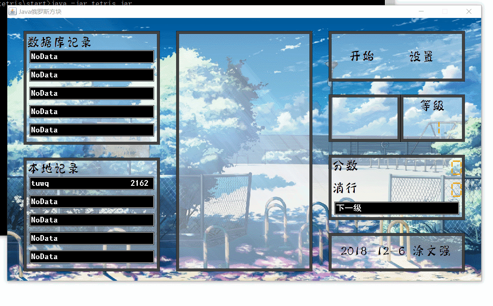
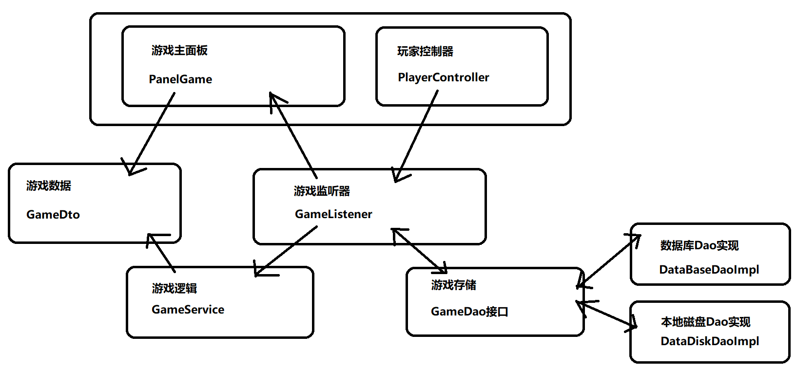

## Java俄罗斯方块

## 运行
1. 需要jdk8及以上运行环境
2. 支持设置修改操作按键
3. 连接数据库需要修改cfg.xml

## 效果

## 游戏如何实现
1. 俄罗斯方块所有方块都是四小块(当然这是经典的俄罗斯方块,可以自行修改)
2. 整个方块可占地图空间为18*18,将地图铺开可以理解为一个坐标系
3. 那么一个方块就是一个坐标系集合,4个方块也就是Point[4],每个Point都有x和y
4. 方块的移动,旋转,堆积,消行自然就是依靠二维坐标系来实现

## 游戏架构

- Main - 主入口 
- FrameGame - 主窗口
- PannelGame - 主面板
- PlayerController - 玩家控制器,监听玩家键盘录入
- GameListener - 监听玩家控制器并对游戏数据修改以及游戏面板刷新
- GameSerice - 游戏逻辑业务层,操作游戏主逻辑
- GameDto - 游戏数据对象,游戏逻辑层修改数据,并将数据渲染至游戏面板
- GameAct - 游戏方块对象,内含方块移动与方块旋转的逻辑
- Layer - 视图层对象的基类
- GameConfigRead - 读取游戏配置
- cfg.xml - 游戏配置文件

